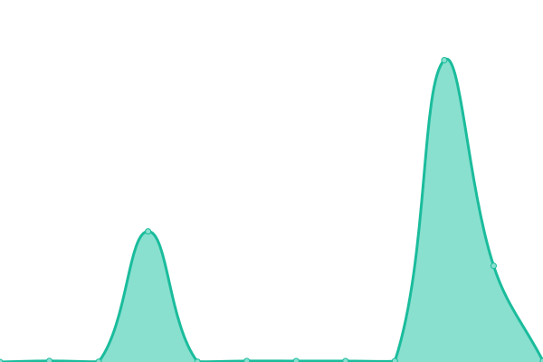

# [📈 Live Status](https://leplatrem.github.io/delivery-upptime): <!--live status--> **🟧 Partial outage**

This repository contains the open-source uptime monitor and status page for [Mathieu Leplatre](http://mathieu-leplatre.info), powered by [Upptime](https://github.com/upptime/upptime).

With [Upptime](https://upptime.js.org), you can get your own unlimited and free uptime monitor and status page, powered entirely by a GitHub repository. We use [Issues](https://github.com/leplatrem/delivery-upptime/issues) as incident reports, [Actions](https://github.com/leplatrem/delivery-upptime/actions) as uptime monitors, and [Pages](https://leplatrem.github.io/delivery-upptime) for the status page.

<!--start: status pages-->
<!-- This summary is generated by Upptime (https://github.com/upptime/upptime) -->
<!-- Do not edit this manually, your changes will be overwritten -->
<!-- prettier-ignore -->
| URL | Status | History | Response Time | Uptime |
| --- | ------ | ------- | ------------- | ------ |
|  [RS](https://delivery-checks.prod.mozaws.net/checks/remotesettings) | 🟩 Up | [rs.yml](https://github.com/leplatrem/delivery-upptime/commits/HEAD/history/rs.yml) | 

 4068ms
     
 | 

<a href="https://leplatrem.github.io/delivery-upptime/history/rs">98.12%</a>
    

|  [RS Uptake](https://delivery-checks.prod.mozaws.net/checks/remotesettings-uptake-release) | 🟩 Up | [rs-uptake.yml](https://github.com/leplatrem/delivery-upptime/commits/HEAD/history/rs-uptake.yml) | 

 1167ms
     
 | 

<a href="https://leplatrem.github.io/delivery-upptime/history/rs-uptake">96.21%</a>
    

|  [RS Lambdas](https://delivery-checks.prod.mozaws.net/checks/remotesettings-lambdas) | 🟥 Down | [rs-lambdas.yml](https://github.com/leplatrem/delivery-upptime/commits/HEAD/history/rs-lambdas.yml) | 

 1699ms
     
 | 

<a href="https://leplatrem.github.io/delivery-upptime/history/rs-lambdas">90.02%</a>
    

<!--end: status pages-->

[**Visit our status website →**](https://leplatrem.github.io/delivery-upptime)

## 📄 License

- Powered by: [Upptime](https://github.com/upptime/upptime)
- Code: [MIT](./LICENSE) © [Mathieu Leplatre](http://mathieu-leplatre.info)
- Data in the `./history` directory: [Open Database License](https://opendatacommons.org/licenses/odbl/1-0/)
